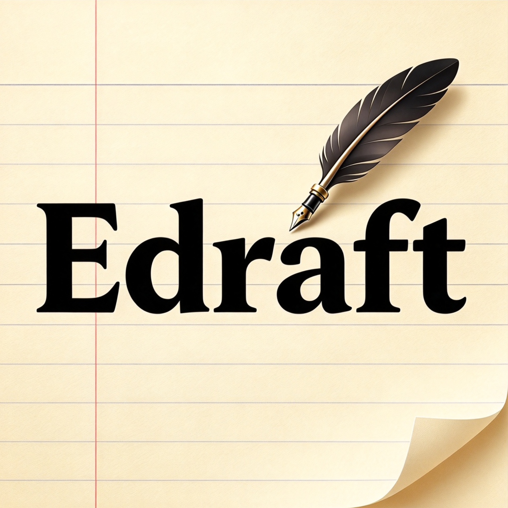

# Edraft

一个极简的 Windows 电子草稿纸

在无限画布上随手放文本框、方框、箭头和图片，还可以导出成 PNG。

纯 C++ 写成，只调用 Windows 自带的 **Win32 API** 与 **GDI+**，不使用 Qt / Electron 等任何第三方 GUI 框架，源码约 2700 行；编译出来是**单个 exe 文件**，拷到别的机器上双击就能用。



---

## 目录

- [功能特性](#功能特性)
- [第一部分：如何使用](#第一部分如何使用)
  - [1. 运行程序](#1-运行程序)
  - [2. 界面说明](#2-界面说明)
  - [3. 鼠标操作](#3-鼠标操作)
  - [4. 快捷键](#4-快捷键)
  - [5. 右键菜单：调整对象的样式](#5-右键菜单调整对象的样式)
  - [6. 存档与导出](#6-存档与导出)
- [第二部分：如何从源码编译](#第二部分如何从源码编译)
  - [环境准备](#环境准备)
  - [方式一：双击 build.bat](#方式一双击-buildbat)
  - [方式二：手动执行命令](#方式二手动执行命令)
  - [编译参数说明](#编译参数说明)
- [项目结构](#项目结构)
- [工作原理](#工作原理)
- [常见问题](#常见问题)
- [关于 AI 使用](#关于-ai-使用)

---

## 功能特性

- **文本框**：双击（或 Enter / F2）进入编辑，支持中文输入法，高度随内容自动增长
- **连接箭头**：拖到对象上自动吸附；对象四条边各有一个连接锚点；拖动被连接的对象时箭头自动跟随
  - 直线 / 折线两种走法，折线带**可拖动的折点手柄**
  - 无箭头 / 单箭头 / 双箭头，实线 / 虚线 / 点线
- **分组方框**：半透明填充、置于底层，用来把内容划分成不同区域；选中后左上角出现**圆形移动手柄**，拖动即可整体挪动
- **图片**：支持 PNG / JPG / BMP / GIF 等；四角手柄等比缩放，四边中点手柄单轴缩放
- **粘贴即用**：`Ctrl+V` —— 剪贴板是文字就生成文本框，是图片就插入图片
- **框选多选**：一次框住一批对象，整体移动或删除
- **无限画布**：半透明网格、平移、缩放、回到原点、适应窗口
- **右键改样式**：线宽、字号可填任意数值，另有颜色、线型、箭头样式
- **纯 C++ + Win32 API + GDI+**：不使用任何第三方 GUI 框架
- **单一 exe 文件**：不需要安装，拷贝即用（绿色便携）
- **适配高 DPI 屏幕**：进程声明 DPI 感知，界面与正文统一使用微软雅黑，不发虚

---

# 第一部分：如何使用

## 1. 运行程序

直接双击 `Edraft.exe` 即可，无需安装，也不会在系统里留下任何东西。

程序把全部内容都保存在你手动保存的 `.edraft` 文件里，**不在注册表或用户目录写任何配置**，所以放在哪里都行（U 盘里也可以）。

## 2. 界面说明

```
┌───────────────────────────────────────────────────────────────┐
│ Edraft                                        文件名.edraft * │  ← 顶部栏目
├───────────────────────────────────────────────────────────────┤
│  指针            添加元素              编辑       文件     视图  │  ← 功能区
│ 选择 平移 框选   方框 文本 箭头 图片   撤销 重做 删除  打开 …   │
├───────────────────────────────────────────────────────────────┤
│                                                               │
│                          画　布                                │
│                                                               │
└───────────────────────────────────────────────────────────────┘
```

功能区按用途分成 5 组，每组一个主题色：

| 组 | 颜色 | 按钮 | 说明 |
|---|---|---|---|
| **指针** | 蓝 | 选择 / 平移 / 框选 | 「平移 / 框选」是**二选一开关**，决定在空白处左键拖动时的行为 |
| **添加元素** | 绿 | 方框 / 文本 / 箭头 / 图片 | 前三个是工具（拖出即建），图片会弹出文件选择框 |
| **编辑** | 橙 | 撤销 / 重做 / 删除 | 撤销/重做在无内容可操作时会**自动变灰** |
| **文件** | 紫 | 打开 / 保存 / 另存为 / 导出 | 导出指导出 PNG |
| **视图** | 青 | 适应 / 原点 / 网格 | 适应＝缩放到刚好容纳全部内容；原点＝回到坐标原点；网格＝开关背景网格 |

处于生效状态的按钮会变深并带白色内描边，一眼能看出当前用的是哪个工具。

## 3. 鼠标操作

| 操作 | 效果 |
|---|---|
| 左键点对象 | 选中（`Ctrl` + 点 = 加减选） |
| 空白左键拖动 | 框选 **或** 平移 —— 由「平移 / 框选」开关决定 |
| `Ctrl` + 空白拖动 | 强制框选加选（不受开关影响） |
| `空格` + 拖动，或中键拖动 | 平移画布 |
| 滚轮 | 以光标为锚点缩放 |
| 拖动对象 | 移动（多选时整体移动） |
| 拖四角 / 四边中点手柄 | 缩放（图片四角为等比，四边中点只改单轴） |
| 拖方框左上角外侧的**圆形手柄** | 整体移动方框 |
| 拖对象四边的**圆形锚点** | 拉出连接箭头 |
| 拖箭头两端的圆点 | 改连接（拖到别的对象上会重新吸附） |
| 拖箭头上的**橙色手柄** | 调整折线折弯位置 |
| 双击文本框 | 进入编辑 |
| **右键** | 打开设置菜单（内容随选中对象类型变化） |

三个容易忽略但很有用的细节：

- **方框是"容器"**。若框选范围**完全落在方框内部**，只会选中里面的内容，不会选中方框本身；
  只有框选**越过方框边缘**（或把它整个框住）时，方框才会一起被选中 ——
  这样在方框内部框选内容时不会被外层的大框"抢选"。
- **选中对象后，它四条边的中点会显示圆形锚点**，既是连接点，也是"我选了哪些"的提示；
  被选中的对象还会带一层淡蓝高亮，多选时也能一眼看出范围。
- **方框只有细边框可以点**，不好命中，所以选中后在左上角外侧专门放了一个圆形移动手柄，
  拖动它就能整体挪动方框。

## 4. 快捷键

| 快捷键 | 功能 |
|---|---|
| **Ctrl + V** | **粘贴**（剪贴板是文字→生成文本框；是图片→插入图片） |
| **Ctrl + O** | 打开 |
| **Ctrl + S** | 保存 |
| **Ctrl + Shift + S** | 另存为 |
| **Ctrl + Z** / **Ctrl + Y** | 撤销 / 重做 |
| **Ctrl + A** | 全选 |
| **Enter** 或 **F2** | 编辑选中的文本框 |
| **Delete** | 删除选中对象（连带其绑定的箭头） |
| **Esc** | 取消选中 / 结束编辑 |
| **空格**（按住） | 临时切换为平移模式 |

## 5. 右键菜单：调整对象的样式

在对象上点右键，菜单内容会按对象类型自动变化：

| 对象 | 可调节项 |
|---|---|
| **文本框** | 编辑文字、**粗体**、**字号**（6 档预设 + 自定义任意数值）、颜色、线宽、线型 |
| **箭头** | **直线 / 折线**、**无箭头 / 单箭头 / 双箭头**、线型（实线/虚线/点线）、线宽、颜色 |
| **方框** | 颜色、线宽、线型 |
| **图片** | 按原始像素显示 |
| **空白处** | 回到原点、适应窗口、显示网格开关 |

线宽的预设是「细(2) / 中(4) / 粗(6) / 很粗(10) / 特粗(16)」，也可以在子菜单最下方选
**「自定义…」**手填数值（0.5 ~ 60）；字号同理（6 ~ 200 磅）。

> 先框选一批对象，再右键改颜色或线宽，会**批量应用到所有选中的同类对象**，比一个个改快得多。

**关于文本框的字号与颜色**：同一个文本框里的文字是**整体统一**的样式（不能做到一句话里半截加粗、半截变红）。
拆成两个文本框即可实现混排。

## 6. 存档与导出

**保存**：`.edraft` 是一个 UTF-8 的文本文件，一行一个对象，**图片以 base64 直接内嵌**。
因此单个文件是自包含的 —— 拷给别人、换台电脑打开都不会丢图。

**打开**：只认 `.edraft` 扩展名。如果你手上有本项目早期的 `.wbdk` 文件，
把扩展名改成 `.edraft` 就能正常打开（加载器按文件内容判断版本，不看扩展名）。

**导出 PNG**：按内容包围盒自动裁切，四周留 30 px 白边，**背景网格不会被导出**。

---

# 第二部分：如何从源码编译

如果你只想用程序，上面就够了。以下是给想要自己编译的人的说明。

## 环境准备

### 只需要一个 MinGW-w64

推荐使用 [MSYS2](https://www.msys2.org/) 或 [w64devkit](https://github.com/skeeto/w64devkit) 自带的 MinGW-w64。
**不需要 Visual Studio，也不需要任何第三方库。**

需要以下两个程序：

| 程序 | 用途 |
|---|---|
| `g++.exe` | 编译 C++ 源码 |
| `windres.exe` | 把图标资源编译进 exe（**g++ 本身不能嵌图标**） |

装好后确认它们的完整路径，例如 `D:\mingw64\bin\g++.exe`。

## 方式一：双击 build.bat

用文本编辑器打开 `build.bat`，确认开头的两行路径和你机器上的实际情况一致：

```bat
set GXX=D:\mingw64\bin\g++.exe
set RC=D:\mingw64\bin\windres.exe
```

然后直接双击运行。它会依次做两件事：

1. 用 `windres` 把 `Edraft.ico` 编译成 `app_res.o`
2. 用 `g++` 把全部源码和 `app_res.o` 链接成 `Edraft.exe`

看到 `[构建成功] Edraft.exe（已嵌入图标）` 就完成了。
如果没有 `Edraft.ico`，脚本会跳过第一步，编译出**无图标版本**（功能完全一样）。

## 方式二：手动执行命令

在源码目录下打开命令行（cmd / PowerShell / Git Bash），依次执行：

```bat
windres app.rc -O coff -o app_res.o

g++ -std=c++17 -O2 -Wall -mwindows -o Edraft.exe ^
    main.cpp model.cpp render.cpp io.cpp ui.cpp app_res.o ^
    -lgdiplus -lgdi32 -luser32 -lole32 -lcomdlg32 -lshlwapi ^
    -static-libgcc -static-libstdc++ -s
```

> 在 **Git Bash** 里把续行符 `^` 换成 `\`。

## 编译参数说明

| 参数 | 含义 |
|---|---|
| `-std=c++17` | 使用 C++17 标准（代码里用了 `inline constexpr` 内联变量） |
| `-O2` | 开启优化 |
| `-Wall` | 打开常用警告 |
| `-mwindows` | 生成**图形界面**程序（不弹出黑色控制台窗口） |
| `-o Edraft.exe` | 输出文件名 |
| `-static-libgcc` / `-static-libstdc++` | 静态链接 GCC 运行库，分发的 exe 不需要额外 DLL |
| `-s` | 去除符号表，减小体积 |
| `-lgdiplus` | GDI+：矢量绘制、文字排版、图片编解码 |
| `-lgdi32` / `-luser32` | 基础绘图与窗口/消息 |
| `-lole32` | COM：`IStream`（图片与 PNG 编码用） |
| `-lcomdlg32` | 打开 / 保存文件对话框 |
| `-lshlwapi` | `SHCreateMemStream`（由内存字节解码图片） |
| `app_res.o` | 图标资源目标文件。**去掉它程序也能编译**，只是 exe 没有图标 |

### 依赖情况

编译产物只依赖 Windows 系统组件，可用
`objdump -p Edraft.exe | findstr "DLL Name"` 自行核验：

```
KERNEL32  USER32  GDI32  SHLWAPI  comdlg32  gdiplus  ole32
+ Universal CRT（Windows 10 自带；Win7/8 需 KB2999226）
```

---

## 项目结构

| 文件 | 作用 |
|---|---|
| `edraft.h` | 公共头文件：常量、类型、全局状态声明、函数原型 |
| `main.cpp` | 程序入口、窗口过程、鼠标/键盘交互、自绘按钮、双缓冲绘制 |
| `model.cpp` | 数据模型与几何：对象查找、连接锚点、箭头路由、命中检测、撤销重做、视图 |
| `render.cpp` | 全部 GDI+ 绘制：对象、网格、选中框、顶部栏目与功能区 |
| `io.cpp` | 持久化与输入输出：`.edraft` 读写、图片编解码、剪贴板、PNG 导出 |
| `ui.cpp` | 文本框就地编辑、自定义数值输入框、右键菜单 |
| `tools/png2ico/` | 图片转多尺寸 `.ico` 的小工具（用来生成程序图标） |
| `app.rc` | 图标资源脚本（内容只有一行） |
| `Edraft.ico` | 程序图标（内含 16/32/48/64/128/256 六种尺寸） |
| `Edraft.png` | 图标源图 |
| `build.bat` | 一键编译脚本 |
| `Edraft.exe` | 已编译好的程序（可直接运行） |

源码总量约 2700 行，每个文件顶部都有详细注释说明其职责。

## 工作原理

```
   鼠标 / 键盘消息
          │
          ▼
   ① 修改数据模型 g_objs（存的是"世界坐标"）
      改动前先 SnapUndo() 把整张表压入撤销栈
          │
          ▼
   ② InvalidateRect 触发 WM_PAINT
          │
          ▼
   ③ 画到内存 DC（双缓冲）：
        DrawGrid    —— 屏幕坐标，步长随缩放自适应
        DrawScene   —— 在"世界坐标变换"下画所有对象
        DrawOverlay —— 屏幕坐标，画选中框/手柄/锚点/框选预览
        DrawChrome  —— 顶部栏目与功能区
          │
          ▼
   ④ BitBlt 一次性贴到窗口
```

几个关键设计：

- **三种坐标空间**：对象存世界坐标；`DrawScene` 用 `Graphics::SetTransform` 统一切换；
  而覆盖层（选中框、手柄、锚点）工作在屏幕坐标 —— 因为手柄必须保持恒定像素大小，不能跟着缩放。
  凡是复用"返回世界坐标"的辅助函数，都要先转成屏幕坐标再用。
- **不闪烁**：`WM_ERASEBKGND` 直接返回 1（禁止擦背景）+ 内存 DC 双缓冲 +
  窗口带 `WS_CLIPCHILDREN`（父窗口重绘不覆盖工具栏按钮等子窗口）。
- **撤销重做**是"整表快照"：每次改动前把对象数组整份压栈。对象数量不大、图片以 `shared_ptr` 共享，
  代价很低，换来实现简单且绝不会漏掉某个字段；快照与栈顶相同则跳过，避免"撤销了个寂寞"。
- **箭头路由**保证严格正交（全程只有水平/垂直线段）：从起点沿出边法向外伸一段，
  再走折线，最后沿入边法向进入终点；S 形与 Z 形的中间段位置可由折点手柄拖动调整。
- **粘贴图片**要先补文件头：剪贴板给的 `CF_DIB` 只有 `BITMAPINFO` + 像素，缺 `BITMAPFILEHEADER`，
  GDI+ 直接解码不了，必须先手工拼一个内存 BMP；拿到位图后统一**再编码成 PNG** 存盘，避免存档体积暴涨。
- **图标**是 `windres` 编进去的。注意光嵌资源还不够，还必须在窗口类上设 `hIcon` / `hIconSm`，
  否则资源管理器里有图标、标题栏却没有。

## 常见问题

**Q：打开文件时提示「只支持 .edraft 文件」？**
本项目早期版本用的是 `.wbdk` 扩展名。把文件改名成 `.edraft` 就能打开，内容不受影响。

**Q：`.edraft` 用记事本打开是一堆乱码 / 超长行？**
文件确实是纯文本，但里面的图片被 base64 编码后是一行很长的字符，记事本可能会卡。
文本类对象（`TEXT` / `RECT` / `ARROW` 行）是可读的，可以直接手改，只是要小心别改坏字段个数。

**Q：为什么点不中方框？**
方框只有细边框能点中（这是有意的，否则会挡住框内的对象）。要移动它，请先选中，
然后拖**左上角外侧的圆形手柄**；要选中它，也可以直接框选（框选范围越过它的边缘即可）。

**Q：在方框内部框选，怎么连方框也一起选中了？**
现在不会了 —— 框选范围完全落在方框内部时只选里面的内容。如果框选范围越过了方框边缘（或把方框整个框住），
方框才会被选中。

**Q：撤销 / 重做按钮是灰的，点不动？**
按钮变灰代表当前没有可撤销（或可重做）的操作。产生新改动后重做栈会失效，按钮也会重新变灰，这是正常的。

**Q：能在一个文本框里给部分文字加粗或换色吗？**
不能。文本框的字体样式是**整个框统一**的。想要混排样式，拆成两个文本框即可。

**Q：高分屏下界面会发虚吗？**
不会。程序启动时声明了 DPI 感知，并按系统 DPI 缩放工具栏、按钮和字体。

**Q：换一台电脑要重装吗？**
不用。`Edraft.exe` 是绿色单文件，拷过去直接跑。它只依赖 Windows 系统组件，
不写注册表、不装服务，也不会在用户目录留垃圾。

---

## 关于 AI 使用

> 本项目由 AI 在人类作者实质性指导下生成，按 MIT 许可证授权。
>
> AI 生成的代码可能存在人类未察觉的疏漏，请自行评估 AI 生成代码的质量与安全性，本项目不提供任何形式的担保。
