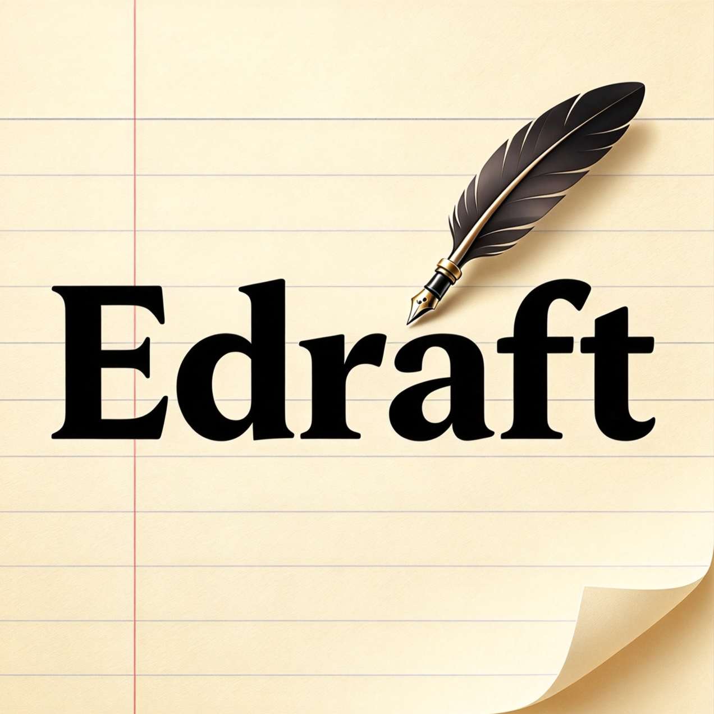

# Edraft

一个极简的 Windows 电子草稿纸：**在无限画布上随手放文本框、方框、箭头和图片，画完可以整体或局部导出成 PNG。**

纯 C++ 写成，只调用 Windows 自带的 **Win32 API** 与 **GDI+**，源码约 3080 行（6 个源文件），不使用 Qt / Electron 等任何第三方 GUI 框架；编译出来是**单个 exe 文件**，拷到别的机器上双击就能用。



---

> **当前版本：v1.1.0.0**（2026-09-28）—— 新增「适应到方框 / 适应方框导出图片」「窗口总是置顶」「新建」与「按钮栏横排 / 竖排」，exe 也补上了文件信息。各版本的详细改动见 [更新历史](#更新历史)。

---

## 目录

- [功能特性](#功能特性)
- [第一部分：如何使用](#第一部分如何使用)
  - [1. 运行程序](#1-运行程序)
  - [2. 界面说明](#2-界面说明)
  - [3. 按钮栏的两种排布](#3-按钮栏的两种排布)
  - [4. 鼠标操作](#4-鼠标操作)
  - [5. 快捷键](#5-快捷键)
  - [6. 对象样式的右键菜单](#6-对象样式的右键菜单)
  - [7. 适应到方框与局部导出](#7-适应到方框与局部导出)
  - [8. 新建文档](#8-新建文档)
  - [9. 保存与导出](#9-保存与导出)
- [第二部分：如何从源码编译](#第二部分如何从源码编译)
  - [环境准备](#环境准备)
  - [方式一：双击 build.bat](#方式一双击-buildbat)
  - [方式二：手动执行命令](#方式二手动执行命令)
  - [编译参数说明](#编译参数说明)
- [项目结构](#项目结构)
- [工作原理](#工作原理)
- [常见问题](#常见问题)
- [更新历史](#更新历史)
- [关于 AI 使用](#关于-ai-使用)

---

## 功能特性

- **文本框**：双击（或 Enter / F2）进入编辑，支持中文输入法，高度随内容自动增长
- **连接箭头**：拖到对象上自动吸附；对象四条边各有一个连接锚点；拖动被连接的对象时箭头自动跟随
  - 直线 / 折线两种走法，折线带**可拖动的折点手柄**
  - 无箭头 / 单箭头 / 双箭头，实线 / 虚线 / 点线
- **分组方框**：半透明填充、置于底层，用来把画布划分成不同区域；选中后左上角出现**圆形移动手柄**，拖动即可整体挪动
- **图片**：PNG / JPG / BMP / GIF 都行；四角手柄等比缩放，四边中点手柄单轴缩放
- **局部聚焦**（v1.1）：右键方框 →「适应到方框」把视野缩放到刚好容纳它；「适应方框导出图片」只把这一块导成 PNG
- **新建**（v1.1）：一键清空画布开一张新草稿；有未保存改动会先问你要不要存
- **窗口总是置顶**（v1.1）：把窗口钉在最前面，方便对照别的程序画图
- **按钮栏横排 / 竖排**（v1.1）：窗口变窄时改成竖排，20 个按钮在左侧排成一列也不会少
- **粘贴即用**：`Ctrl+V` —— 剪贴板是文字就生成文本框，是图片就插入图片
- **框选多选**：一次框住一批对象，整体移动或删除
- **无限画布**：半透明网格、平移、缩放、回到原点、适应窗口
- **右键改样式**：线宽、字号可填任意数值，另有颜色、线型、箭头样式
- **撤销 / 重做**：整表快照，绝不会漏掉某个属性；无可撤销内容时按钮自动变灰
- **存档自包含**：`.edraft` 是纯文本，图片以 base64 内嵌，拷给别人不会丢图
- **纯 C++ + Win32 API + GDI+**：不使用任何第三方 GUI 框架
- **单一 exe 文件**：不需要安装，拷贝即用（绿色便携）
- **适配高 DPI 屏幕**：进程声明 DPI 感知，界面与正文统一使用微软雅黑，不发虚
- **带文件信息**（v1.1）：exe 属性里能看到文件说明、版本号、产品名、版权等

---

# 第一部分：如何使用

## 1. 运行程序

直接双击 `Edraft.exe` 即可，无需安装。

程序把全部内容都保存在你手动保存的 `.edraft` 文件里，**不在注册表或用户目录写任何配置**，
所以放在哪里都行 —— U 盘、网盘同步目录、移动硬盘都可以，拷走就是全部。

## 2. 界面说明

```
┌───────────────────────────────────────────────────────────────┐
│ Edraft 1.1.0.0                               文件名.edraft *  │  ← 顶部栏目
├───────────────────────────────────────────────────────────────┤
│  指针          添加元素              编辑      文件      视图 │  ← 功能区
│ 选择 平移 框选 方框 文本 箭头 图片  撤销 重做 删除  打开 …    │
├───────────────────────────────────────────────────────────────┤
│                                                               │
│                            画　布                             │  ← 画布（无限大）
│                                                               │
└───────────────────────────────────────────────────────────────┘
```

顶部栏目左边是程序名与版本号，右边是当前文件名（有未保存的改动会带一个 `*`）。

功能区按用途分成 5 组，每组一个主题色：

| 组 | 颜色 | 按钮 | 说明 |
|---|---|---|---|
| **指针** | 蓝 | 选择 / 平移 / 框选 | 「平移 / 框选」是**二选一开关**，决定在空白处左键拖动时的行为 |
| **添加元素** | 绿 | 方框 / 文本 / 箭头 / 图片 | 前三个是工具（拖出即建），图片会弹出文件选择框 |
| **编辑** | 橙 | 撤销 / 重做 / 删除 | 撤销 / 重做在无内容可操作时会**自动变灰** |
| **文件** | 紫 | 新建 / 打开 / 保存 / 另存为 / 导出 | 导出指导出 PNG |
| **视图** | 青 | 适应 / 原点 / 网格 / 置顶 / 竖排 | 适应＝缩放到刚好容纳全部内容；原点＝回到坐标原点；网格＝开关背景网格；置顶＝窗口总在最前；竖排＝按钮栏改竖排 |

处于生效状态的按钮会变深并带白色内描边 —— 当前用的是哪个工具、网格开没开、窗口是否已置顶，
一眼就能看出来。

## 3. 按钮栏的两种排布

按钮栏有两种排布，点「视图」组里的**竖排 / 横排**按钮即可切换（按钮上写的是"点一下会变成什么"）：

```
横排（默认，窗口够宽时最省地方）    竖排（窗口窄时用）           
┌────────────────────────────┐      ┌──────┬────────────────────┐
│ 选择 平移 框选 方框 文本 … │      │ 指针 │                    │
│                            │      │ 选择 │                    │
│           画　布           │      │ 平移 │       画　布       │
│                            │      │ 框选 │                    │
└────────────────────────────┘      │ …    │                    │
                                    └──────┴────────────────────┘
```

两种排布都不需要横向滚动条，各自的自适应规则是：

| 排布 | 自适应规则 |
|---|---|
| **横排** | 窗口不够宽时，按钮宽度与组间距**等比压窄（最多压到 62%）**。窗口宽度 ≳ 730 逻辑像素就还显示得全（760 实测完好） |
| **竖排** | 按钮高度按可用高度**自动压缩（26 → 最低 17 像素）**；装不下时先换更紧凑的组间距，再压按钮高度。窗口高度 ≳ 560 逻辑像素时 20 个按钮全都在 |

> **提示**：窗口窄到连按钮都显示不全（比如只剩半截「另存为」）时，
> 在**画布空白处点右键 →「按钮栏改为竖排」**。这条菜单项不依赖按钮栏本身，
> 任何窗口尺寸都点得到，换过去就全都回来了。

## 4. 鼠标操作

| 操作 | 效果 |
|---|---|
| 左键点对象 | 选中（`Ctrl` + 点 = 加减选） |
| 空白左键拖动 | 框选 **或** 平移 —— 由「平移 / 框选」开关决定 |
| `Ctrl` + 空白拖动 | 强制框选加选（不受开关影响） |
| `空格` + 拖动，或中键拖动 | 平移画布 |
| 滚轮 | 以光标为锚点缩放 |
| 拖动对象 | 移动（多选时整体移动） |
| 拖四角 / 四边中点手柄 | 缩放（图片四角为等比，四边中点只改单轴） |
| 拖方框左上角外侧的**圆形手柄** | 整体移动方框（方框只有细边框可点，不好命中，才专门给了这个手柄） |
| 拖对象四边的**圆形锚点** | 拉出连接箭头 |
| 拖箭头两端的圆点 | 改连接（拖到别的对象上会重新吸附） |
| 拖箭头上的**橙色手柄** | 调整折线折弯位置 |
| 双击文本框 | 进入编辑 |
| **右键** | 打开设置菜单（内容随选中对象类型变化） |

三个容易忽略但很有用的细节：

- **方框是"容器"**。若框选范围**完全落在方框内部**，只会选中里面的内容，不会选中方框本身；
  只有框选**越过方框边缘**（或把它整个框住）时，方框才会一起被选中 ——
  这样在方框内部框选内容时，不会被外层的大框"抢选"。
- **选中对象后，它四条边的中点会显示圆形锚点**，既是连接点，也是"我选了哪些"的提示；
  被选中的对象还会带一层淡蓝高亮，多选时也能一眼看出范围。
- **对象是分层绘制的**：方框在最底 → 图片 → 文本框 → 箭头在最上。
  所以箭头永远压在最前面，不会被方框的半透明填充盖住。

## 5. 快捷键

| 快捷键 | 功能 |
|---|---|
| **Ctrl + N** | **新建**（有未保存改动会先弹窗问） |
| **Ctrl + V** | **粘贴**（剪贴板是文字→生成文本框；是图片→插入图片） |
| **Ctrl + O** | 打开 |
| **Ctrl + S** | 保存 |
| **Ctrl + Shift + S** | 另存为 |
| **Ctrl + Z** / **Ctrl + Y** | 撤销 / 重做 |
| **Ctrl + A** | 全选 |
| **Enter** 或 **F2** | 编辑选中的文本框 |
| **Delete** | 删除选中对象（连带其绑定的箭头） |
| **Esc** | 取消选中 / 结束编辑 |
| **空格**（按住） | 临时切换为平移模式 |

这些快捷键走的是主窗口的按键处理，**光标停在文本框里编辑时不会误触发**；
反过来，正在编辑文本框时 `Ctrl+V` 粘的是文字（交给输入框处理），退出编辑后才是"粘贴为对象"。

## 6. 对象样式的右键菜单

在对象上点右键，菜单内容会按对象类型自动变化：

| 对象 | 可调节项 |
|---|---|
| **文本框** | 编辑文字、**粗体**、**字号**（6 档预设 + 自定义任意数值）、颜色、线宽、线型，以及适应到此对象 / 适应对象导出图片 |
| **箭头** | **直线 / 折线**、**无箭头 / 单箭头 / 双箭头**、线型（实线 / 虚线 / 点线）、线宽、颜色 |
| **方框** | 颜色、线宽、线型，以及 **适应到方框 / 适应方框导出图片** |
| **图片** | 按原始像素显示，以及适应到此对象 / 适应对象导出图片 |
| **空白处** | 回到原点、适应窗口、显示网格、窗口总是置顶、按钮栏改为竖排、新建空白草稿纸 |

菜单第一行是只读信息（"方框 #3  300 × 200" / "已选中 5 个对象"），只用来确认你点到的是什么。

线宽的预设是「细(2) / 中(4) / 粗(6) / 很粗(10) / 特粗(16)」，也可以在子菜单最下方选
**「自定义…」**手填数值（0.5 ~ 60）；字号同理（6 ~ 200 磅）。

> **提示**：先框选一批对象，再右键改颜色或线宽，会**批量应用到所有选中的同类对象**
> （图片不参与），比一个个改快得多。

**关于文本框的字号与颜色**：同一个文本框里的文字是**整体统一**的样式，做不到一句话里半截加粗、半截变红；
想要混排样式，拆成两个文本框即可。

## 7. 适应到方框与局部导出

画布很大、只想看或只想交付其中一小块时，用围绕内容的**方框**圈定范围，然后在方框上点右键：

| 菜单项 | 作用 |
|---|---|
| **适应到方框** | 把视图缩放到刚好完整显示这个方框（四周留 40 像素余量），画布上别的内容就不会挤进来 |
| **适应方框导出图片…** | 只管这一块：导出的 PNG **只包含这个方框及其内部内容**，1:1 像素输出，四周留 16 像素白边 |

几点说明：

- 边框是"骑"在边线上画的，粗边框会向外溢出一半。**这两项都自动把线宽算进范围**
  （按 `strokeW / 2` 外扩），所以 16 像素的特粗边框也不会被裁掉半个。
- 导出与「导出」按钮走的是同一套绘制代码，1:1 像素、**不带网格**，区别只是不问你保存位置，
  默认文件名叫 `region.png`。
- 选中多个对象时，这两项叫「适应到选区 / 适应选区导出图片…」，按整个选区的外接矩形来算；
  只选中箭头时不会出现这两项（箭头没有可圈的范围）。
- 视图被缩放到方框上之后，点「原点」按钮即可回到常规视野（缩放归 1、回到坐标原点附近）。

## 8. 新建文档

点「新建」或按 `Ctrl+N`。如果当前内容还没保存，会先弹一个「是否先保存？」的三选一窗：

| 按钮 | 行为 |
|---|---|
| **是** | 先保存。没存过就弹"另存为"；**若你在"另存为"里点了取消，整个新建操作就作废**（不会悄悄丢内容） |
| **否** | 直接丢掉当前内容，开始新草稿 |
| **取消** | 什么都不做 |

新建之后画布清空、视图复位，存档路径也一起忘掉（下次保存会重新问你存哪）。
关闭窗口时走的是同一套提示。

## 9. 保存与导出

**保存**：`.edraft` 是 UTF-8 的文本文件，一行一个对象，**图片以 base64 直接内嵌**，
所以单个文件是自包含的。格式长这样（`EDRAFT3` 是文件头）：

```
EDRAFT3
RECT  1 260 74 320 260 4883124 10 0
TEXT  2 300 120 240 60 14 1 1710618 4 0 这是正文\n第二行
IMAGE 3 640 74 480 270 iVBORw0KGgoAAAANSUhEUg...
ARROW 4 1 2 2 0 1 1 0 2631720 6 260 204 300 150 0.5
```

**打开**：只认 `.edraft` 扩展名。加载器是按"文件头版本号 + 每行字段个数"双重判断的，
能读回历代格式（`WBDK1` / `WBDK2` / `EDRAFT1` / `EDRAFT2` / `EDRAFT3`）。
如果你手上有本项目早期的 `.wbdk` 文件，把扩展名改成 `.edraft` 就能打开。

**导出 PNG**：按内容包围盒自动裁切，四周留 30 像素白边；背景是白的，**网格不会被导出**。
只想导出局部就用上一节说的「适应方框导出图片」。

---

# 第二部分：如何从源码编译

如果你只想用程序，上面就够了。以下是给想要自己编译的人的说明。

## 环境准备

### 1. 编译器：MinGW-w64（提供 `g++` 和 `windres`）

推荐使用 [MSYS2](https://www.msys2.org/) 或 [w64devkit](https://github.com/skeeto/w64devkit) 自带的 MinGW-w64。
**不需要 Visual Studio，也不需要任何第三方库**（GDI+ 是 Windows 自带的）。

需要以下两个程序：

| 程序 | 用途 |
|---|---|
| `g++.exe` | 编译 C++ 源码 |
| `windres.exe` | 把图标与版本信息编进 exe（**g++ 本身不能嵌资源**） |

装好后确认它们的完整路径，例如 `D:\mingw64\bin\g++.exe`。

### 2. 图标（可选）

`Edraft.ico` 已经在仓库里了，直接编译即可。想换成自己的图标，用
`tools\png2ico\png2ico.exe 你的图.png 你的图.ico` 生成一份多尺寸 ico；或者干脆删掉 `Edraft.ico`
（脚本会把资源里的图标那一行滤掉，编译出**无图标但仍有版本信息**的版本，功能完全一样）。

## 方式一：双击 build.bat

用文本编辑器打开 `build.bat`，确认开头的两行路径和你机器上的实际情况一致：

```bat
set GXX=D:\mingw64\bin\g++.exe
set RC=D:\mingw64\bin\windres.exe
```

然后直接双击运行。它会依次做两件事：

1. 用 `windres` 把 `app.rc`（图标 + 版本信息）编译成 `app_res.o`
2. 用 `g++` 把全部源码和 `app_res.o` 链接成 `Edraft.exe`

看到 `[构建成功] Edraft.exe（已嵌入图标与版本信息）` 就完成了。

## 方式二：手动执行命令

在源码目录下打开命令行（cmd / PowerShell / Git Bash），依次执行：

```bat
windres --codepage=65001 app.rc -O coff -o app_res.o

g++ -std=c++17 -O2 -Wall -mwindows -o Edraft.exe ^
    main.cpp model.cpp render.cpp io.cpp ui.cpp app_res.o ^
    -lgdiplus -lgdi32 -luser32 -lole32 -lcomdlg32 -lshlwapi ^
    -static-libgcc -static-libstdc++ -s
```

> 在 **Git Bash** 里把续行符 `^` 换成 `\`。

> ⚠ `--codepage=65001` **不能省**。`app.rc` 是 UTF-8 编码的文件，而 `windres` 默认按系统 ANSI
> （简体中文系统上是 GBK）去读它；不加这个参数，编译出来的 exe 属性里"文件说明""产品名称"这些中文会变成乱码。

## 编译参数说明

| 参数 | 含义 |
|---|---|
| `-std=c++17` | 使用 C++17 标准（代码里用了 `inline constexpr` 内联变量） |
| `-O2` | 开启优化 |
| `-Wall` | 打开常用警告 |
| `-mwindows` | 生成**图形界面**程序（不弹出黑色控制台窗口） |
| `-o Edraft.exe` | 输出文件名 |
| `-static-libgcc` / `-static-libstdc++` | 静态链接 GCC 运行库，这样分发的 exe 不需要额外的 DLL |
| `-s` | 去除符号表，减小体积（成品约 1.47 MB，其中图标占 370 KB） |
| `-lgdiplus` | GDI+：矢量绘制、文字排版、图片编解码 |
| `-lgdi32` / `-luser32` | 基础绘图与窗口 / 消息 |
| `-lole32` | COM：`IStream`（图片与 PNG 编码用） |
| `-lcomdlg32` | 打开 / 保存文件对话框 |
| `-lshlwapi` | `SHCreateMemStream`（由内存字节解码图片） |
| `app_res.o` | 图标与版本信息资源。**去掉它程序也能编译**，只是 exe 既没有图标也没有版本信息 |

### 依赖情况

编译产物只依赖 Windows 系统组件，可用
`objdump -p Edraft.exe | findstr "DLL Name"` 自行核验：

```
KERNEL32  USER32  GDI32  SHLWAPI  comdlg32  gdiplus  ole32
+ Universal CRT（Windows 10 自带；Win7/8 需 KB2999226）
```

---

## 项目结构

| 文件 | 作用 |
|---|---|
| `edraft.h` | 公共头文件：常量、类型、全局状态声明、函数原型 |
| `main.cpp` | 程序入口、窗口过程、鼠标 / 键盘交互、自绘按钮、双缓冲绘制 |
| `model.cpp` | 数据模型与几何：对象查找、连接锚点、箭头路由、命中检测、撤销重做、视图 |
| `render.cpp` | 全部 GDI+ 绘制：对象、网格、选中框、顶部栏目与功能区、横 / 竖两套按钮排布 |
| `io.cpp` | 持久化与输入输出：`.edraft` 读写、新建、图片编解码、剪贴板、PNG 导出 |
| `ui.cpp` | 文本框就地编辑、自定义数值输入框、右键菜单、窗口置顶 |
| `app.rc` | 资源脚本：程序图标 + 版本信息（`VERSIONINFO`） |
| `Edraft.ico` | 程序图标（内含 16/32/48/64/128/256 六种尺寸） |
| `Edraft.png` | 图标源图 |
| `tools/png2ico/` | 图片转多尺寸 `.ico` 的小工具（用来生成程序图标） |
| `build.bat` | 一键编译脚本 |
| `Edraft.exe` | 已编译好的程序（可直接运行） |
| `*.edraft` / `export.png` | **运行时由你自己生成**的存档与导出图（仓库里没有） |

源码总量约 3080 行（6 个 .cpp / .h 文件），每个文件顶部都有详细注释说明其职责。

## 工作原理

```
   鼠标 / 键盘消息
          │
          ▼
   ① 修改数据模型 g_objs（存的是"世界坐标"）
      改动前先 SnapUndo() 把整张表压入撤销栈
          │
          ▼
   ② InvalidateRect 触发 WM_PAINT
          │
          ▼
   ③ 画到内存 DC（双缓冲）：
        DrawGrid    —— 屏幕坐标，步长随缩放自适应
        DrawScene   —— 在"世界坐标变换"下画所有对象
        DrawOverlay —— 屏幕坐标，画选中框 / 手柄 / 锚点 / 框选预览
        DrawChrome  —— 顶部栏目与功能区
          │
          ▼
   ④ BitBlt 一次性贴到窗口
```

细节说明：

- **三种坐标空间**：对象存世界坐标；`DrawScene` 用 `Graphics::SetTransform` 统一切换；
  而覆盖层（选中框、手柄、锚点）工作在屏幕坐标 —— 因为手柄必须保持恒定像素大小，不能跟着缩放。
  凡是复用"返回世界坐标"的辅助函数，都要先用 `PFS()` 转成屏幕坐标再画，否则图形会整体偏移。
- **画布区的原点只有一个来源**：`(g_cvX, g_cvY)`。横排时它等于 `(0, 顶栏 + 功能区高度)`，
  竖排时等于 `(功能区宽度, 顶栏高度)`。画布裁剪、鼠标是否落在画布上、图片与粘贴的落点、缩放适应 ——
  全都只看这两个值，所以切换排布时其余代码一行都不用改。
- **工具栏按钮是子窗口，不是画上去的**：只有真正的 `BUTTON` 控件才能稳当地处理点击与禁用态，
  于是用 `BS_OWNERDRAW` + `WM_DRAWITEM` 自己画外观（`OnDrawItem`）。
  排布由 `LayoutToolbar()` 统一负责，按钮只在启动时创建一次，之后只 `MoveWindow`，所以切换排布是瞬时的。
- **不闪烁**：`WM_ERASEBKGND` 直接返回 1（禁止擦背景）+ 内存 DC 双缓冲 +
  窗口带 `WS_CLIPCHILDREN`（父窗口重绘不覆盖工具栏按钮等子窗口）。
- **撤销重做是"整表快照"**：每次改动前把对象数组整份压栈。对象数量不大、图片以 `shared_ptr` 共享，
  代价很低，换来实现简单且绝不会漏掉某个字段；快照与栈顶相同则跳过，避免"撤销了个寂寞"。
- **箭头路由保证严格正交**：从起点沿出边法向外伸一段（`gap = 18`），再走折线，最后沿入边法向进入终点，
  全程只有水平 / 垂直线段；S 形与 Z 形的中间段位置可由折点手柄拖动调整（`bend` 限制在 −0.5 ~ 1.5）。
- **导出局部区域没有另写绘制路径**：把"世界坐标 → 屏幕坐标"的平移临时换成"以目标矩形左上角为原点"，
  再调一次同一个 `DrawScene` 即可；矩形之外的内容会被位图边界自然裁掉。
- **粘贴图片要先补文件头**：剪贴板给的 `CF_DIB` 只有 `BITMAPINFO` + 像素，缺 `BITMAPFILEHEADER`，
  GDI+ 直接解码不了，必须先手工拼一个内存 BMP；拿到位图后统一**再编码成 PNG** 存盘，避免存档体积暴涨。
- **图标与版本信息都是 `windres` 编进去的**。注意光嵌资源还不够，还必须在窗口类上设 `hIcon` / `hIconSm`，
  否则会出现"资源管理器里有图标、标题栏却是默认图标"。

## 常见问题

**Q：工具栏右侧的按钮显示不全 / 看不到「竖排」按钮？**
横排按钮栏在窗口变窄时会自动等比压窄（最多 62%），一般把窗口拉到 760 像素宽以上就能看全。
再窄就会被裁掉右侧的按钮，此时**在画布空白处点右键 →「按钮栏改为竖排」**（这条菜单项不依赖按钮栏，
任何尺寸都点得到），换成竖排就全都回来了。

**Q：竖排时最下面一两个按钮被截掉了？**
20 个按钮一列排下来需要约 560 像素的窗口高度，窗口太矮就只能裁（实测 640 × 480 的窗口会少掉最下面两个）。
竖排的本意是解决**窗口太窄**的场景；如果窗口又窄又矮，建议先把窗口拉高一点。

**Q：点「新建」时弹出"是否先保存？"，三个按钮分别是干什么的？**
「是」= 先保存（没存过就弹"另存为"；如果你在"另存为"里点了取消，整个新建操作作废）、
「否」= 不保存直接清空、「取消」= 什么都不做。

**Q：导出的图片为什么是白底、网格不见了？**
导出走的是"内容"而不是"屏幕"：白底 + 对象本身，背景的半透明网格不会被导出。
这样图拿去贴文档、发消息才干净；想要连网格一起要，就只能自己截图。

**Q：「适应方框导出图片」出来的图多大？**
按 1:1 世界像素输出：宽高 = 方框宽高 + 一个线宽 + 四周各 16 像素白边。
例如 300 × 200、线宽 10 的方框，导出 342 × 242 像素。
它与**当前视图缩放无关** —— 顺手滚了下滚轮也不会让导出结果变形。

**Q：exe 属性里的版本信息在哪儿看 / 想改怎么改？**
资源管理器里右键 `Edraft.exe` → 属性 → **详细信息** 选项卡，能看到文件说明、文件版本、产品名称、版权等。
要改内容就编辑 `app.rc` 里的 `VERSIONINFO` 段（记得 `FILEVERSION` 与 `edraft.h` 里的 `APP_VER` 保持一致），
重新编译即可。

**Q：打开文件时提示「只支持 .edraft 文件」？**
本项目早期版本用的是 `.wbdk` 扩展名。把文件改名成 `.edraft` 就能打开 —— 加载器看的是文件内容，不是扩展名。

**Q：`.edraft` 用记事本打开是一堆乱码 / 超长行？**
文件确实是纯文本，但图片被 base64 编码后是一行很长的字符，记事本可能会卡。
`RECT` / `TEXT` / `ARROW` 这几行是可读的，可以直接手改，只是要小心别改坏字段个数
（加载器也要靠字段个数判断格式版本，少一个字段就会被当成旧格式解析）。

**Q：为什么点不中方框？**
方框只有细边框能点中（这是有意的，否则会挡住框内的对象）。要移动它，请先选中，
然后拖**左上角外侧的圆形手柄**；要选中它，也可以直接框选（框选范围越过它的边缘即可）。

**Q：撤销 / 重做按钮是灰的，点不动？**
按钮变灰代表当前没有可撤销（或可重做）的操作。产生新改动后重做栈会失效，按钮也会重新变灰，这是正常的。

**Q：能在一个文本框里给部分文字加粗或换色吗？**
不能。文本框的字体样式是**整个框统一**的。想要混排样式，拆成两个文本框即可。

**Q：高分屏下界面会发虚吗？**
不会。程序启动时声明了 DPI 感知，并按系统 DPI 缩放工具栏、按钮、行高和边距
（都是按 `g_dpiScale` 算出来的），所以 100% / 150% / 175% 缩放下观感一致，字体也不发虚。

**Q：换一台电脑要重装吗？**
不用。`Edraft.exe` 是绿色单文件，拷过去直接跑。它只依赖 Windows 系统组件，
不写注册表、不装服务，也不会在用户目录留垃圾。

---

## 更新历史

### v1.1.0.0 — 2026-09-28

**新增**

- **适应到方框 / 适应方框导出图片**：右键方框（文本框、图片同样支持）的菜单底部新增两项。
  「适应到方框」按新增的 `ZoomToBounds()` 缩放到刚好容纳它（四周留 40 像素）；
  「适应方框导出图片…」只导出这一块，1:1 像素、四周留 16 像素。
  两者都按 `strokeW / 2` 把线宽算进范围 —— 边框是"骑"在边线上画的，不这样处理，
  线宽 16 的方框会少掉最外一圈。
  新增的 `SelBounds()` 负责算选中集合的外接矩形，多选时菜单文案自动变成「适应到选区」。
- **「总是置顶」**：视图组新增置顶按钮（自绘按钮的选中态复用 `IsBtnChecked`），
  实现是 `SetWindowPos(HWND_TOPMOST / HWND_NOTOPMOST)`。画布右键菜单里也有。
- **「新建」**：文件组新增新建按钮与 `Ctrl+N`。有未保存改动时走新增的
  `ConfirmLoseChanges()` → 三选一窗（是 / 否 / 取消）；「是」会先调 `SaveMaybeAs()`，
  在"另存为"里取消则整个新建作废。关闭窗口的提示也统一改成了同一套逻辑
  （原来是"是否退出？"的是 / 否两选一，选"否"只是不退出，并没有"保存后再走"这条路）。
- **按钮栏横排 / 竖排**：视图组新增切换按钮（标题动态显示"点一下会变成什么"），画布右键菜单里也有。
  竖排时按钮在左侧排成一列、每组一个组名，组名用各组的主题色。
- **exe 文件信息**：`app.rc` 增加 `VERSIONINFO` 资源（产品名、文件说明、版本、版权、原始文件名等），
  `build.bat` 的 windres 调用加上 `--codepage=65001`。

**改进**

- **画布原点统一成 `(g_cvX, g_cvY)`**：原来画布上边界硬编码在 `g_tbH`（等于顶栏 + 功能区高度），
  散落在鼠标判定、网格绘制、裁剪区、图片与粘贴的落点等多处，改竖排要把这些地方全找出来。
  现在只由 `LayoutToolbar()` 一处算出，其余代码只看这两个值。
  「鼠标是否落在画布上」的判断也从"只看 y"改成"x、y 都看"。
- **横排按钮栏宽度自适应**：窗口变窄时按钮宽度与组间距一起等比压窄（`TB_HSHRINK = 0.62`），
  这样"窗口略小"不会立刻把后面几组按钮挤到窗口外。
- **竖排按钮高度自适应**：按可用高度反推按钮高度（`TB_VMAX_H = 26` → `TB_VMIN_H = 17`）；
  装不下时先切"紧凑间距"（组名行高 15 → 12、组间距 7 → 4、按钮间距 2 → 1），再压按钮高度。
- **窗口尺寸变化会重排**（新增 `WM_SIZE` 处理）；切换排布不重建按钮，只 `MoveWindow` + 重绘，是瞬时的。
- 标题栏与顶部栏目都带上了版本号；对象右键菜单里给新功能加了分隔线，与原有样式设置视觉上分开。
- 插入图片与 `Ctrl+V` 粘贴的落点改成"画布区中心"（原来算的是窗口中心，竖排时会偏）。

**文档**

- 重写本 README：补更新历史、两种排布各自的自适应规则、局部导出章节，
  以及"按钮显示不全怎么办"等已知限制与兜底操作。

### v1.0.0.0 — 2026-09-25

首个正式发布版本（开源上线）。

- 无限画布 + 半透明网格、平移、缩放、回到原点、适应窗口；
- 文本框：双击 / Enter / F2 就地编辑（用真实的 `EDIT` 子窗口，中文输入法可用），高度按内容自动增长；
- 连接箭头：对象四边中点各有一个连接锚点，拖拽自动吸附；直线 / 折线两种走法（折线带可拖动的折点手柄）；
  无箭头 / 单箭头 / 双箭头、实线 / 虚线 / 点线，线宽与颜色可调；
- 分组方框：半透明填充、置于底层，选中后左上角有圆形移动手柄；框选是"容器语义"
  （选框完全落在方框内部时不选中方框本身）；
- 图片：支持 PNG / JPG / BMP / GIF，四角手柄等比缩放、四边中点手柄单轴缩放；
- `Ctrl+V` 粘贴：剪贴板是文字就生成文本框，是图片就插入图片
  （`CF_DIB` 手工补文件头后统一转 PNG 存储）；
- 框选多选、整体移动与删除；撤销 / 重做采用整表快照，栈空时按钮自动置灰；
- 右键菜单按对象类型动态组装：颜色、线宽、线型、字号（含自定义数值输入框）；
- 存档 `.edraft`（UTF-8 文本、图片 base64 内嵌、`EDRAFT3` 头），加载器兼容更早的
  `WBDK1` / `WBDK2` / `EDRAFT1` / `EDRAFT2` 格式；导出 PNG 按内容包围盒裁切、四周留 30 像素、不导出网格；
- 纯 Win32 API + GDI+，单一 exe，无第三方依赖；声明 DPI 感知，按系统 DPI 缩放界面；
- 补全全部源码注释，生成 MIT `LICENSE` 与 `.gitignore`。

## 关于 AI 使用

> 本项目由 AI 在人类作者实质性指导下生成，按 MIT 许可证授权。
>
> AI 生成的代码可能存在人类未察觉的疏漏，请自行评估 AI 生成代码的质量与安全性，本项目不提供任何形式的担保。
